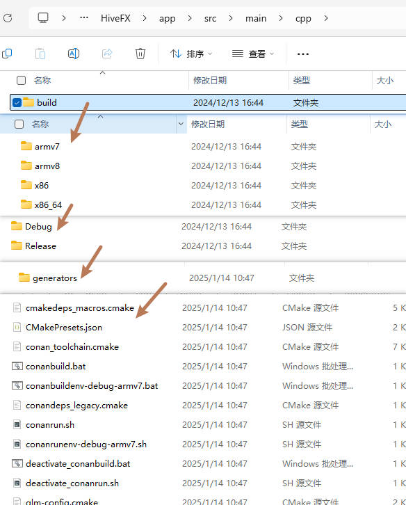
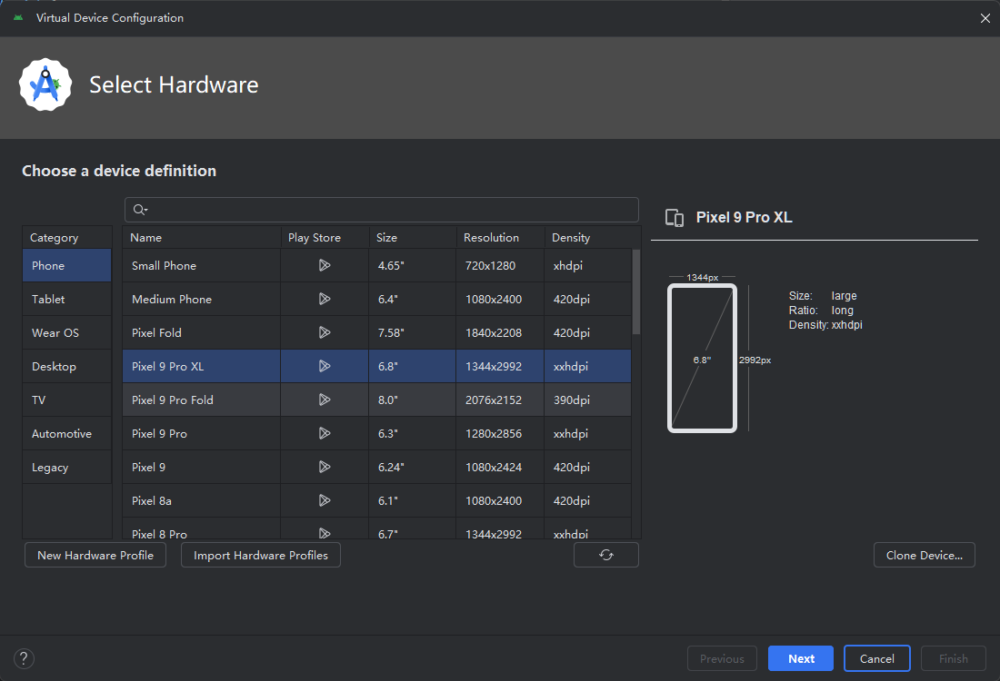
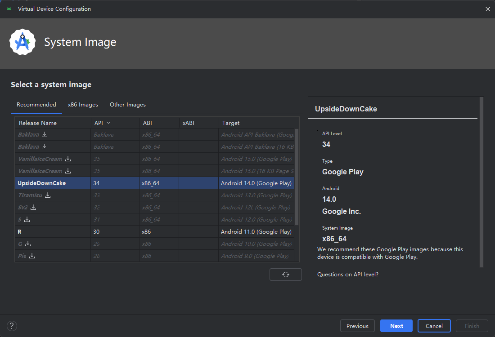
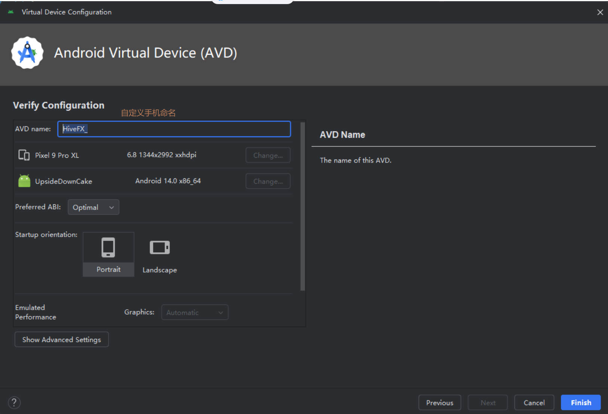

# HiveFX
 play cartoon in mobile phone.

## 环境配置

Gradle : 8.9

第三方环境库配置：conan

## 运行步骤

1. 配置 conan 环境；
2. 运行 `HiveFX\app\src\main\cpp\generateConanPkg.bat` 文件，运行结果是在同级 `cpp` 目录下生成 `build` 文件夹，文件夹具体内容如 图1 所示；
3. 配置手机。手机配置过程见下；
4. 运行程序。

 图1. 生成的build文件夹
## 手机配置

## 运行结果

点击手机下方，左，中，右屏幕分别对应着雪景、雨景和云效（Billboard），点击屏幕上方展示的是积雪场景。在手机上的效果如下图所示。

